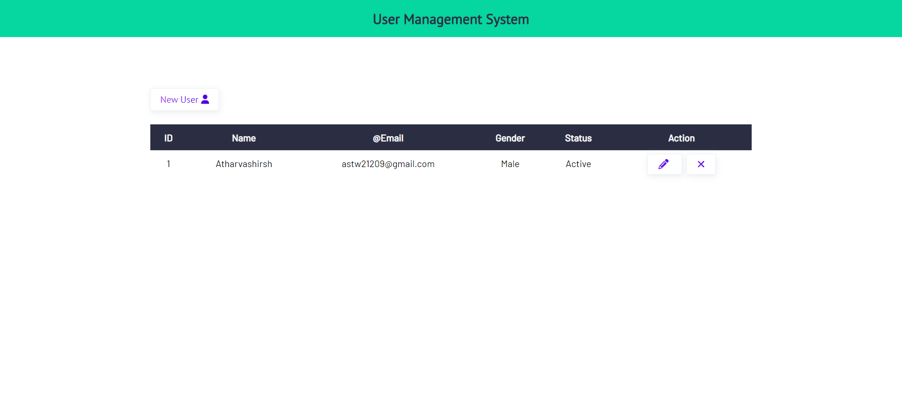
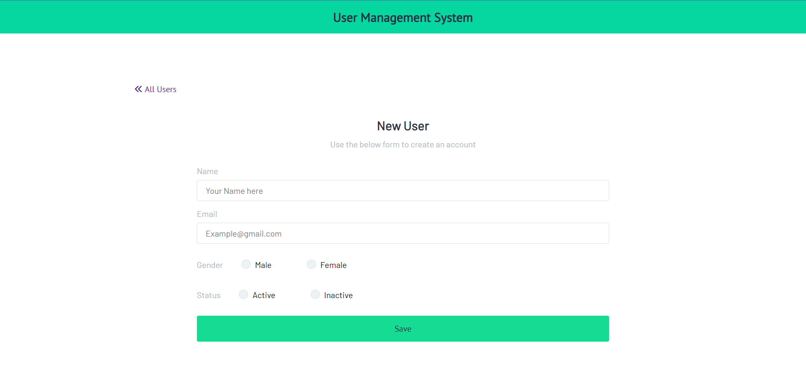
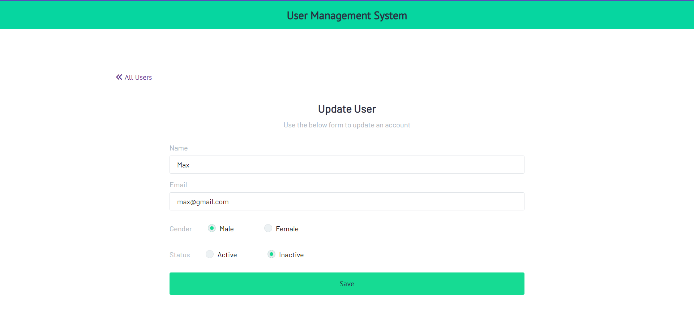

# User Database Management System

A User Database Management System is a project built with MongoDB, Express.js, and Node.js that allows you to manage user data efficiently. It provides functionalities for creating, reading, updating, and deleting user records in a MongoDB database.

## Installation

1. Clone the repository:
```
git clone https://github.com/your-username/user-database-management-system.git
```

2. Install the dependencies:
```
npm install
```

3. Configure the MongoDB connection:

-   Open the `config.env` file in the project's root directory.
-   Replace the `MONGO_URI` value with your MongoDB connection string.

4. Start the server:
```
npm start
```

5. Access the application in your browser at 
```
http://localhost:3000 
```

## Usage

-   The home page displays a list of all users in the database.
-   To add a new user, click on the "Add User" button and fill in the required details.
-   To view the details of a specific user, click on their name in the user list.
-   To update a user's information, click on the "Edit" button next to their name and make the necessary changes.
-   To delete a user, click on the "Delete" button next to their name.

## Configuration

The MongoDB connection can be configured by modifying the `config.env` file. Update the `MONGO_URI` value with your MongoDB connection string.

## Screenshots

<div align=center>
  
<table>
  <tr>
    <th>Home Page</th>
  </tr>
  <tr>
    <td></td>
  </tr>
</table>

<table>
  <tr>
    <th>Add User</th>
    <th>Update User</th>
  </tr>
  <tr>
    <td></td>
    <td></td>
  </tr>
</table>

</div>
